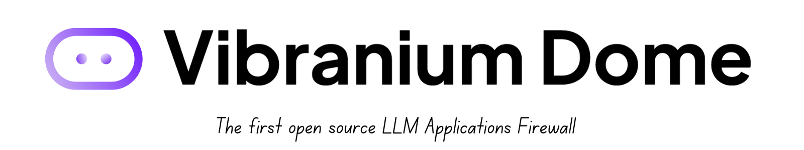
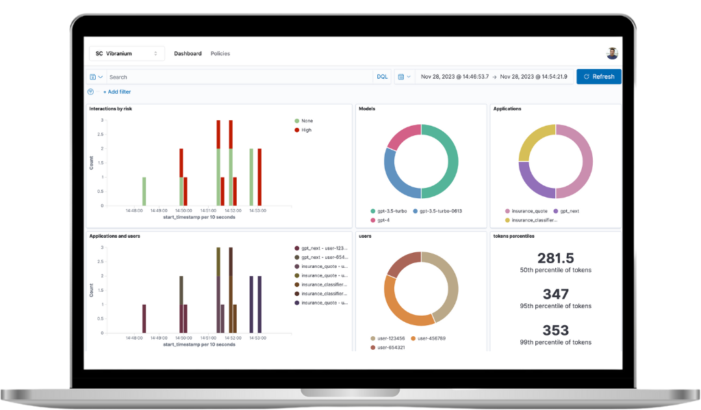
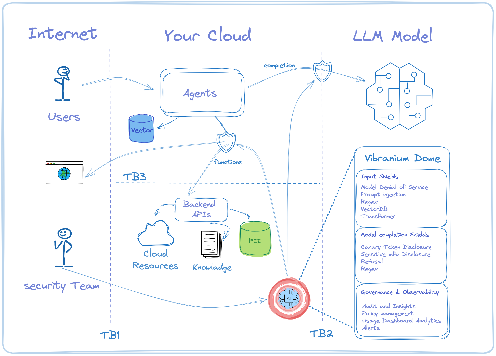

[](https://www.gnu.org/licenses/gpl-3.0.en.html)
[](https://github.com/genia-dev/vibraniumdome/actions/workflows/ci.yml)

<p align=center>
   <a href="https://vibraniumdom.com" target="_blank">
      
   </a>
</p>
<br>

## Overview

LLM Agents are the new tool in every cutting edge tech team toolbox.
Just like with Cloud applications, The new set of challanges with LLMs is enabling the organization to move fast, while not compormizing on customer data and security best practices.

The project is composed of:
* [Full-Stack Web-Application](./vibraniumdome-app/README.md) - For management & dashboard.
* [Shields Server](./vibraniumdome-shields/README.md) -  Receives LLM interactions via [Open Telemetry](https://opentelemetry.io) from the [vibraniumdome-sdk](https://github.com/genia-dev/vibraniumdome-sdk).
* [OpenSearch](./vibraniumdome-opensearch/README.md) - Provides storage & query analytics for LLM interactions received by the [Shields Server](./vibraniumdome-shields/README.md).


See [Getting Started](#getting-started) how to run all-in-one.

#### Vulnerabilities in focus

- Prompt Injections [LLM01](https://llmtop10.com/llm01/)
  - Direct - also known as "jailbreaking"
  - Indirect
- Insecure Output Handling [LLM02](https://llmtop10.com/llm02/)
- Model Denial of Service [LLM04](https://llmtop10.com/llm04/)
- Sensitive Information Disclosure [LLM06](https://llmtop10.com/llm06/)
- Insecure Plugin Design [LLM07](https://llmtop10.com/llm07/)
- Excessive Agency [LLM08](https://llmtop10.com/llm08/)

## Key features

VibraniumDome is a cutting edge innovative open source platform that empowers security teams in the LLM Agents era.

Full blown, end to end LLM WAF for Agents, allowing security teams govenrance, auditing, policy driven control over Agents usage of language models.

<p float="center">
   
</p>

<details>
  <summary><b>100% open source</b></summary>
   end to end full blown application, including shields, models, big data analytics tools, container deployment, authentication managment and web application dashboard, everything is open source, not just a sdk to a paywall endpoint. no fine prints.
</details>

<details>
  <summary><b>Built for LLM security teams</b></summary>
  Our goal is to help early adopters and enterprises harness the power of LLMs, combined with enterprise grade security best practices. we are focused on LLM cyber security challanges!
</details>

<details>
  <summary><b>Data protection first</b></summary>
  Your sensitive data never leaves your premise
</details>

<details>
  <summary><b>Fine grained policies</b></summary>
  Controlled in realtime by the security teams dashboards
</details>

<details>
  <summary><b>Zero latency impact</b></summary>
  Non intrusive by design so everything is completely async
</details>

<details>
  <summary><b>Blazing fast big data analytics</b></summary>
  built with the most demanding cutting edge engineering standards
</details>

<details>
  <summary><b>One line setup, literally. yes, that simple!</b></summary>
  we worked hard so all the magic happens externally to your applicaiton critical path workflow
</details>

```python
 VibraniumDome.init(app_name="your_agent_name_here")
```

## The Vibranium Dome Design

<p float="center">
   
</p>
<br/>

## Vibranium Shields

Vibranium shields are the core of the Vibranium Dome layer of defences, and they are designed to protect Agents and critical resources from the LLM threats

#### Input shields

* [X] Prompt injection transformer shield
* [X] Model denial of service shield
* [X] Captain's shield
* [X] Semantic vector similarity shield
* [X] Regex Input shield
* [X] Prompt safety moderation shield
* [ ] Secret prompt detection shield
* [ ] Malicous URLs shield

#### Output shields

* [X] Canary token disclosure shield
* [X] Model refusal shield
* [X] PII and Sensetive information disclosure shield
* [X] Regex output shield
* [ ] Language detection shield
* [ ] Code completion shield
* [ ] Markdown completion shield
* [ ] Secret completion detection shield
* [ ] SQL completion guardrail shield
* [ ] function calling guardrail shield

### Dozens of shields and integrations coming soon

Vibranium Dome ecosystem is growing fast, we are working with security researchers, domain experts and looking for more code contributors to add more industry best practices and integrations

## Demo

https://github.com/genia-dev/vibraniumdome/assets/16246393/58f44d36-12bc-4622-9c80-fdc0e3113e5f


## Getting Started

Follow documentation details [here](https://docs.vibraniumdome.com/quickstart)

## Contributing

We would appreciate your contributions! 🙌🌟💖
👩‍💻➕👨‍💻 Fork repository, make your changes, and submit a pull request!
More details can be found [here](./CONTRIBUTING.md).

## License

GNU General Public License v3.0 or later

See [LICENSE](./LICENSE) to see the full text.

## Contact

Got an idea to improve our project? We'd love to hear it and collaborate with you. Don't hesitate to reach out to us! Just open an [issue](https://github.com/genia-dev/vibraniumdome/issues) and we will respond to you 🦸‍♀️🦸‍♂️ !
You can see details [here](./.github/ISSUE_TEMPLATE/submit-a-request.md).

## Future Plans

- fine tuned models specifically trained to detect prompt injection
- function calling shields
- k8s egress waf implementation so we can take out even the single line of code
- dual model detection plus injection
- Alerting framework
- Integration with your enterprise security applications

## Documentation

https://docs.vibraniumdome.com
